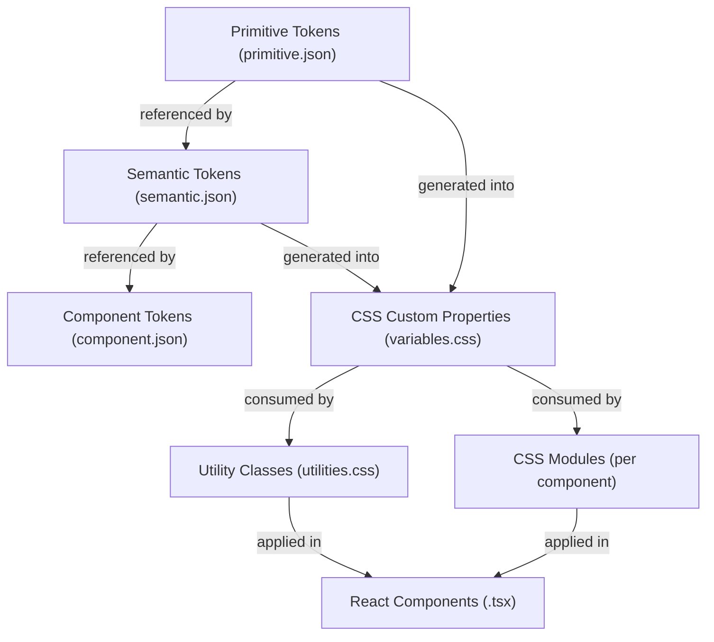
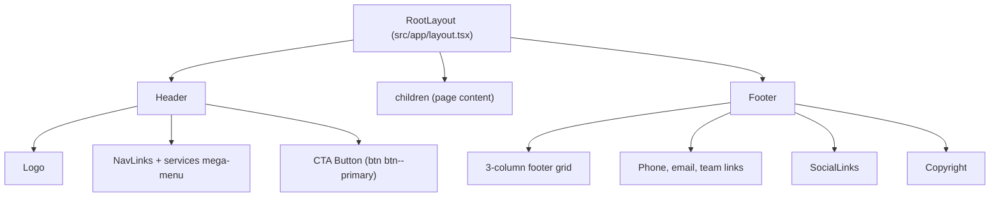
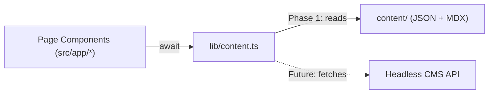

# Reloadux: WordPress to Next.js Migration Plan

## Current State

- **Live WordPress site** at reloadux.com -- 21 pages, 16 service pages, 8+ case studies, blog, industry pages
- **Design system** extracted from 5 Figma pages into a unified HTML library at [design-system/library.html](design-system/library.html)
- **3-tier token system** in [design-system/tokens/](design-system/tokens/):
  - `primitive.json` (307 lines) -- raw values: colors, typography, spacing, radius, shadows, motion
  - `semantic.json` (235 lines) -- purpose-driven aliases: `text-primary`, `bg-dark`, `border-subtle`, etc.
  - `component.json` (406 lines, v1.3.0) -- component-level patterns: button, header, card, hero, form, etc.
- **CSS custom properties** already generated in [design-system/css/variables.css](design-system/css/variables.css) (274 lines)
- **Utility classes** in [design-system/css/utilities.css](design-system/css/utilities.css) (288 lines)
- **Page-level styles** in [src/styles.css](src/styles.css) (719 lines) -- hero, btn, service-card, cta-glow, process-grid, reveal, responsive breakpoints

---

## Styling Approach: Existing Semantic Layers Only

**NO Tailwind CSS.** The entire styling system flows through the existing 3-tier token architecture:




Every style declaration references semantic variables -- never raw hex values:

```css
/* CORRECT -- semantic layer */
.hero { background-color: var(--bg-dark); color: var(--text-on-dark); }
.card { border: 1px solid var(--border-subtle); border-radius: var(--radius-12); }
.title { font-family: var(--font-primary); font-size: var(--text-48); }

/* WRONG -- raw values */
.hero { background-color: #090909; color: #FFFFFF; }
```

---

## Phase 1: Project Scaffolding

### 1A. Initialize Next.js App

Create a Next.js 15 project at the workspace root:

```bash
npx create-next-app@latest . --typescript --app --eslint --no-tailwind --src-dir --import-alias "@/*"
```

Flags: `--no-tailwind` (critical), `--app` (App Router), `--src-dir` (source directory).

Resulting structure:

```
Website/
├── src/
│   ├── app/                    # Next.js App Router pages
│   │   ├── layout.tsx          # Root layout (fonts, globals)
│   │   ├── page.tsx            # Home page
│   │   ├── globals.css         # Merged global stylesheet
│   │   ├── about-us/
│   │   ├── contact-us/
│   │   ├── blog/
│   │   ├── service/[slug]/
│   │   └── case-study/[slug]/
│   ├── components/
│   │   ├── layout/             # Header, Footer
│   │   └── ui/                 # Button, Card, Tag, etc.
│   └── lib/
│       ├── content.ts          # CMS-ready data fetching
│       └── types.ts            # TypeScript interfaces
├── content/                    # Local JSON/MDX (CMS interim)
├── public/
│   ├── design-system/          # PRESERVED library (copy)
│   ├── images/                 # Site images
│   └── fonts/                  # Self-hosted fonts (optional)
├── design-system/              # PRESERVED AS-IS (original)
├── next.config.ts
├── tsconfig.json
└── package.json
```

### 1B. Global Stylesheet Assembly

Create `src/app/globals.css` by merging existing CSS files in this order:

1. **Reset & base** -- from [src/styles.css](src/styles.css) lines 178-217 (box-sizing, html, body, img, a, ul reset)
2. **CSS custom properties** -- import all `:root` vars from [design-system/css/variables.css](design-system/css/variables.css) (primitive + semantic tokens, spacing, radius, shadows, motion, z-index, layout)
3. **Utility classes** -- import from [design-system/css/utilities.css](design-system/css/utilities.css) (text colors, bg colors, type composites, font weights, radii, shadows, containers, sections, scroll-reveal, reduced-motion)
4. **Shared component base styles** -- port from [src/styles.css](src/styles.css): `.container`, `.section`, `.section--dark/light/surface`, `.btn`, `.btn--primary`, `.btn--outline`, `.cta-glow`, `.reveal`, responsive breakpoints, reduced-motion

This gives every component access to the full semantic token surface via `var(--*)` and the utility class library.

### 1C. Preserve Design System Library

- **Copy** `design-system/` into `public/design-system/` so it serves at `/design-system/library.html`
- **Keep the original** `design-system/` folder at the workspace root untouched (your working reference)
- Add `design-system/` to the Next.js `tsconfig.json` exclude list so it doesn't interfere with the build

---

## Phase 2: Shared Components (Layout Shell)

Build from the live WordPress site's header/footer. All styling through semantic CSS vars and existing utility classes -- no inline styles, no Tailwind.

### Component Hierarchy




### Key Shared Components


| Component             | File                                                        | Styling                                                    | Token Source                           |
| --------------------- | ----------------------------------------------------------- | ---------------------------------------------------------- | -------------------------------------- |
| `Header`              | `src/components/layout/Header.tsx` + `.module.css`          | Sticky, transparent bg, backdrop-blur                      | `header.*` in component.json           |
| `Footer`              | `src/components/layout/Footer.tsx` + `.module.css`          | Dark bg, 3-column grid                                     | `footer.*` in component.json           |
| `Button`              | `src/components/ui/Button.tsx` + `.module.css`              | Uses `.btn`, `.btn--primary`, `.btn--outline` base classes | `button.primary.*`, `button.outline.*` |
| `SectionTag`          | `src/components/ui/SectionTag.tsx`                          | `.type-tag` utility + semantic color vars                  | `tag.*` in component.json              |
| `SectionHeader`       | `src/components/ui/SectionHeader.tsx`                       | `.section-header`, `.section-header__title`                | Semantic text/bg tokens                |
| `TestimonialCarousel` | `src/components/ui/TestimonialCarousel.tsx` + `.module.css` | Horizontal scroll, autoplay                                | `testimonial.*` in component.json      |
| `CaseStudyCard`       | `src/components/ui/CaseStudyCard.tsx` + `.module.css`       | Dark card surface, hover lift                              | `case-study-card.*`                    |
| `StatCounter`         | `src/components/ui/StatCounter.tsx` + `.module.css`         | Animated count-up                                          | `stat-row.*`                           |
| `BlogCard`            | `src/components/ui/BlogCard.tsx` + `.module.css`            | Image + text stack                                         | `blog-article-card.*`                  |
| `ExpertiseCard`       | `src/components/ui/ExpertiseCard.tsx` + `.module.css`       | Domain cards (AI, SaaS, etc.)                              | Semantic tokens                        |


### Styling Pattern for Every Component

```tsx
// src/components/ui/Button.tsx
import styles from './Button.module.css';

interface ButtonProps {
  variant?: 'primary' | 'outline';
  children: React.ReactNode;
  href?: string;
}

export function Button({ variant = 'primary', children, href }: ButtonProps) {
  const className = `btn btn--${variant} ${styles.button}`;
  if (href) return <a href={href} className={className}>{children}</a>;
  return <button className={className}>{children}</button>;
}
```

```css
/* src/components/ui/Button.module.css */
.button {
  /* Component-specific overrides only -- base comes from globals.css .btn */
  transition: var(--transition);
}
```

**Rule**: Global base classes (`.btn`, `.section`, `.container`, `.reveal`, `.type-`*) come from `globals.css`. CSS Modules handle component-specific layout, positioning, and overrides. Every value references a `var(--*)` token.

---

## Phase 3: Content Abstraction Layer (CMS-Ready)

### Architecture




### Implementation in `src/lib/content.ts`

```typescript
export async function getHomePage(): Promise<HomePageData> { ... }
export async function getServices(): Promise<Service[]> { ... }
export async function getServiceBySlug(slug: string): Promise<Service | null> { ... }
export async function getCaseStudies(): Promise<CaseStudy[]> { ... }
export async function getCaseStudyBySlug(slug: string): Promise<CaseStudy | null> { ... }
export async function getBlogPosts(page?: number): Promise<PaginatedPosts> { ... }
export async function getBlogPostBySlug(slug: string): Promise<BlogPost | null> { ... }
export async function getAboutPage(): Promise<AboutPageData> { ... }
export async function getContactPage(): Promise<ContactPageData> { ... }
```

When you connect a headless CMS later, you swap only the implementations inside these functions. No component changes.

### Local Content Storage

```
content/
├── pages/
│   ├── home.json          # Hero text, stats, testimonials, expertise data
│   ├── about.json         # Team, values, stats, history
│   └── contact.json       # Form fields, FAQ items, next-steps
├── services/
│   ├── _index.json        # Services listing + categories
│   ├── ux-redesign.json
│   ├── ai-opportunity-mapping.json
│   └── ...
├── case-studies/
│   ├── vocable.mdx        # Long-form with embedded React components
│   ├── occ.mdx
│   └── ...
└── blog/
    ├── ai-first-product-redesign.mdx
    └── ...
```

### Type Definitions in `src/lib/types.ts`

TypeScript interfaces for every content model: `HomePageData`, `Service`, `CaseStudy`, `BlogPost`, `AboutPageData`, `ContactPageData`, `Testimonial`, `Stat`, `ExpertiseDomain`, etc.

---

## Phase 4: Core Pages (Exact Replicas)

Build the 6 core pages as exact 1:1 replicas of the live WordPress site. Every section, layout, spacing, color, and typography must match.


| WordPress URL          | Next.js Route        | File                                 |
| ---------------------- | -------------------- | ------------------------------------ |
| `/`                    | `/`                  | `src/app/page.tsx`                   |
| `/about-us/`           | `/about-us`          | `src/app/about-us/page.tsx`          |
| `/contact-us/`         | `/contact-us`        | `src/app/contact-us/page.tsx`        |
| `/blog/`               | `/blog`              | `src/app/blog/page.tsx`              |
| `/service/*`           | `/service/[slug]`    | `src/app/service/[slug]/page.tsx`    |
| `/case-study/vocable/` | `/case-study/[slug]` | `src/app/case-study/[slug]/page.tsx` |


### Home Page (`/`) -- Section Breakdown

From the live site, the home page has these sections in exact order:

1. **Hero** -- dark bg (`--bg-dark`), WebGL backdrop (Unicorn Studio), headline in Libre Baskerville, subtitle in Manrope, white CTA button
2. **Portfolio Carousel** -- horizontal auto-scroll strip of project thumbnails
3. **Services Section** -- `[ OUR SERVICES ]` tag, 3-column categorized service links (AI-native, Research, Design, Deliver)
4. **Stats Row** -- 4 counters on dark bg: "engagement", "x raise", "+1% increase", "$450M raised"
5. **Expertise Grid** -- `[ DIVERSITY ]` tag, 4 domain cards (AI, SaaS, Fintech, Healthcare) with tag lists
6. **Work Showcase** -- `[ OUR WORK ]` tag, alternating case study cards with images and descriptions
7. **Testimonial Carousel** -- numbered quotes (/01, /02...), client names, company logos, holographic shape decoration
8. **Latest Blog Articles** -- horizontal scroll of blog cards with category tags, dates, read times
9. **CTA Section** -- purple glow effect (`--gradient-purple-glow`), "Ready to make your product experience AI-native?" + contact form

Each section uses:

- `.section` / `.section--dark` / `.section--light` from globals
- `.container` for max-width centering
- Semantic color vars for all colors
- Typography utility classes (`.type-hero`, `.type-heading-xl`, `.type-body`, `.type-tag`)
- Component tokens from `component.json` for specific measurements

### About Us (`/about-us`)

Uses component tokens: `about-hero`, `stat-row`, `values-section`, `glance-section`, `team-grid`, `about-cta`.

### Contact Us (`/contact-us`)

Uses component tokens: `contact-hero`, `contact-form`, `faq-accordion`, `next-steps-card`, `testimonial-section`. Form submission via Next.js Server Action (or API route).

### Blog (`/blog` + `/blog/[slug]`)

Uses component tokens: `blog-hero`, `blog-article-card`, `blog-share-bar`, `blog-toc`. MDX rendering via `next-mdx-remote`.

### Service Detail (`/service/[slug]`)

Dynamic route. Start with 2-3 services (UX Redesign, AI Opportunity Mapping, Design from Scratch) to establish template. Reuses existing styles from [src/styles.css](src/styles.css): `.hero`, `.services-grid`, `.service-card`, `.process-grid`, `.process-step`.

### Case Study (`/case-study/[slug]`)

Dynamic route. Vocable as reference implementation. Uses `case-study-card` tokens for the listing view, MDX for long-form content.

---

## Phase 5: Animations and Interactivity

Port existing animations using the CSS motion tokens already defined in `variables.css`:


| Animation          | Source                                                                                                                | Next.js Implementation                                                  | CSS Tokens Used                                        |
| ------------------ | --------------------------------------------------------------------------------------------------------------------- | ----------------------------------------------------------------------- | ------------------------------------------------------ |
| Scroll reveal      | [src/animations.js](src/animations.js)                                                                                | `useScrollReveal` hook + `.reveal` / `.is-visible` classes from globals | `--duration-entrance`, `--ease-out`, `--stagger-delay` |
| WebGL backdrop     | Unicorn Studio SDK                                                                                                    | Client component + `next/script` `strategy="lazyOnload"`                | `--z-unicorn`                                          |
| Number counters    | [ai-opportunity-mapping.js](src/services/ux-redesign-ai-integration/ai-opportunity-mapping/ai-opportunity-mapping.js) | `useCountUp` hook                                                       | `--duration-slow`                                      |
| Testimonial slider | New                                                                                                                   | `embla-carousel-react`                                                  | Motion tokens for transition timing                    |
| Magnetic buttons   | ai-opportunity-mapping.js                                                                                             | `useMagneticEffect` hook                                                | `--ease-spring`                                        |
| Cursor glow        | ai-opportunity-mapping.js                                                                                             | `useCursorGlow` hook (client component)                                 | `--blur-glow`, `--opacity-glow`                        |


All hooks check `prefers-reduced-motion` and respect the existing `@media (prefers-reduced-motion: reduce)` rules in globals.

---

## Phase 6: SEO and Metadata

- Each page exports `metadata` or `generateMetadata()` with title, description, Open Graph, Twitter cards
- Port JSON-LD structured data from existing pages
- `src/app/sitemap.ts` -- dynamic sitemap generation matching current WordPress URL structure
- `src/app/robots.ts` -- robots.txt generation
- Canonical URLs must match WordPress URLs exactly (trailing slash handling in `next.config.ts`)
- `trailingSlash: true` in next.config.ts to match WordPress URL convention

---

## Phase 7: Deployment Strategy

### Vercel Deployment

1. Initialize git repo, push to GitHub
2. Connect repo to Vercel
3. Configure `reloadux.com` domain:
  - Add domain in Vercel dashboard
  - Update DNS: A record `76.76.21.21` or CNAME to `cname.vercel-dns.com`
  - Vercel auto-provisions SSL
4. WordPress URL redirects in `next.config.ts`:

```typescript
async redirects() {
  return [
    // Handle any WordPress-specific URLs that changed
    { source: '/wp-admin/:path*', destination: '/', permanent: true },
    { source: '/wp-content/:path*', destination: '/', permanent: true },
  ];
}
```

1. Set `trailingSlash: true` to match existing WordPress URL convention

### Environment Variables

```
NEXT_PUBLIC_SITE_URL=https://reloadux.com
CMS_API_URL=           # empty until CMS connected
CMS_API_TOKEN=         # empty until CMS connected
CONTACT_FORM_ENDPOINT= # form handler (or use Server Actions)
```

---

## Headless CMS Integration Path (Future)

When ready:

1. Choose CMS (Sanity, Strapi, or WordPress REST API as headless)
2. Define content models matching `src/lib/types.ts` interfaces
3. Swap implementations in `src/lib/content.ts` from local JSON/MDX to CMS API calls
4. Enable ISR (Incremental Static Regeneration) with `revalidate` on each page
5. Set up CMS webhooks for on-demand revalidation

Zero component or styling changes needed -- only `lib/content.ts` implementations change.

---

## Dependencies (Minimal)

```
next, react, react-dom          # Core
typescript, @types/react        # TypeScript
framer-motion                   # Animations (scroll reveal, counters)
embla-carousel-react            # Testimonial + blog carousels
next-mdx-remote                 # MDX content rendering
gray-matter                     # Frontmatter parsing
```

**NOT included**: tailwindcss, postcss (beyond Next.js default), any CSS framework.

---

## File Impact Summary

- **Preserved untouched**: `design-system/` (library.html, tokens, assets, CSS, work-page.html, contact-page.html, index.html)
- **Copied to public**: `design-system/` -> `public/design-system/` (for static serving)
- **Ported into globals.css**: `design-system/css/variables.css` + `design-system/css/utilities.css` + base styles from `src/styles.css`
- **New files**: `src/app/`, `src/components/`, `src/lib/`, `content/`, config files
- **Reference only (not modified)**: `src/services.html`, `src/animations.js`, `src/services/`** -- used as visual/behavioral reference during migration

